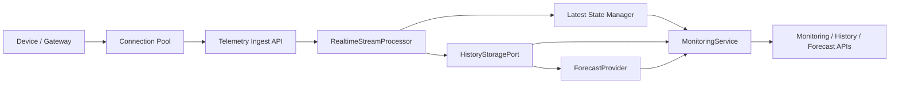

# Energy-Grid-Core

Energy-Grid-Core is a simplified backend foundation for energy monitoring and device state management. It was extracted from reusable patterns in the `carbon` service, then cleaned to remove school-specific workflows, domain-specific coal logic, user/auth coupling, and sensitive interfaces. The result is a modular Python backend skeleton focused on four core capabilities:

- device connection pooling
- realtime telemetry ingestion
- historical data storage interfaces
- pluggable time-series forecast integration

## Repository Status

This repository is suitable for public source visibility on GitHub.

- No hardcoded secrets or environment-specific endpoints are included.
- Runtime configuration is loaded from environment variables only.
- Local artifacts such as `.env`, `.venv`, `.DS_Store`, and SQLite database files are ignored.
- Dependencies are pinned to versions that were tested in the local virtual environment.

## License Notice

This repository is currently **source-visible but not open-source**.

- See [LICENSE](LICENSE) for the exact terms.
- The current license is `All rights reserved`.
- If you want others to reuse or modify the code, replace the current license with one you explicitly choose, such as MIT or Apache-2.0.

## Design Goals

- High-concurrency telemetry ingestion through a bounded async queue and batch flush pipeline.
- Modular service boundaries so connection management, stream processing, history storage, and forecasting can evolve independently.
- Clear extension points for protocol adapters and time-series forecasting providers.
- Zero hardcoded runtime secrets or deployment-specific settings.

## Core Capabilities

### 1. Device Connection Pool

- `DeviceConnectionPool` tracks active device sessions and enforces a configurable connection ceiling.
- Heartbeat updates are separated from telemetry persistence so monitoring reads do not depend on synchronous storage writes.
- The pool exposes immutable snapshots for dashboard-style overview queries.

### 2. Realtime Stream Processing

- `RealtimeStreamProcessor` accepts normalized telemetry events through an `asyncio.Queue`.
- Events are flushed in bounded batches, reducing persistence contention during burst traffic.
- Latest device state is updated before history persistence, which keeps overview APIs responsive.

### 3. Historical Data Storage Interface

- `HistoryStoragePort` defines the standard append and query contract.
- `SQLAlchemyHistoryStorage` is the default backend and writes telemetry into SQLite out of the box.
- `InMemoryHistoryStorage` remains available for lightweight demos and isolated tests.

### 4. Forecast Integration Interface

- `ForecastProvider` defines a stable contract for time-series prediction.
- `NoopForecastProvider` is included as a placeholder so the service can run without model dependencies.
- A future `ProphetForecastProvider`, ARIMA adapter, or custom model can implement the same interface without changing API handlers.

## Runtime Architecture



## Tech Stack

- `Python 3.11`
- `FastAPI`
- `SQLAlchemy 2.0`
- `pytest`
- `httpx`

## Project Layout

```text
project-root/
├── app/
│   ├── api/             # 路由接口
│   ├── core/            # 核心配置与工具
│   ├── models/          # 数据库模型
│   └── services/        # 业务逻辑层
├── tests/               # 自动化测试
├── .env.example         # 环境变量模版（拒绝硬编码）
├── .gitignore
├── .editorconfig
├── LICENSE
├── pyproject.toml
├── requirements.txt
└── main.py              # 入口文件
```

## API Surface

- `POST /api/v1/devices/connect`: register a device session in the connection pool
- `DELETE /api/v1/devices/{device_id}`: remove a device session from the pool
- `POST /api/v1/monitoring/ingest`: enqueue one realtime telemetry event
- `GET /api/v1/monitoring/overview`: fetch the latest monitoring summary
- `GET /api/v1/history/{device_id}`: query retained history for one device
- `POST /api/v1/forecast/{device_id}`: invoke the forecast provider interface

## Environment Requirements

- Python `>=3.11,<4.0`
- macOS, Linux, or another environment capable of running FastAPI and SQLite

## Installation

```bash
python3 -m venv .venv
source .venv/bin/activate
pip install -r requirements.txt
cp .env.example .env
```

## Running The Service

```bash
source .venv/bin/activate
uvicorn main:app --host 0.0.0.0 --port 8000
```

The default `.env.example` uses `HISTORY_STORAGE_BACKEND=sqlalchemy`, so telemetry is written to the configured SQLite database out of the box.

## Running Tests

```bash
source .venv/bin/activate
pytest
```

## Environment Variables

| Variable | Purpose | Default |
| --- | --- | --- |
| `APP_NAME` | Service display name | `Energy-Grid-Core` |
| `APP_VERSION` | Application version | `0.0.0.1` |
| `API_PREFIX` | Shared API prefix | `/api/v1` |
| `APP_HOST` | Runtime host | `0.0.0.0` |
| `APP_PORT` | Runtime port | `8000` |
| `APP_DEBUG` | Enable debug mode | `false` |
| `LOG_LEVEL` | Root log level | `INFO` |
| `DATABASE_URL` | SQLAlchemy database URL | `sqlite:///./energy_grid_core.db` |
| `HISTORY_STORAGE_BACKEND` | History backend selector | `sqlalchemy` |
| `MAX_DEVICE_CONNECTIONS` | Connection pool size | `1000` |
| `STREAM_QUEUE_MAXSIZE` | Telemetry queue capacity | `50000` |
| `STREAM_BATCH_SIZE` | Flush batch size | `500` |
| `STREAM_FLUSH_INTERVAL_SECONDS` | Max flush interval | `1.0` |
| `TELEMETRY_RETENTION_PER_DEVICE` | In-memory retention limit | `1000` |
| `DEFAULT_HISTORY_LIMIT` | Default history query limit | `200` |
| `DEFAULT_FORECAST_HORIZON` | Default forecast horizon | `24` |
| `FORECAST_PROVIDER` | Forecast provider identifier | `noop` |

## Why This Skeleton Handles High Throughput

- Connection lifecycle and telemetry persistence are decoupled.
- Latest-state reads avoid scanning historical data.
- Buffered writes convert many small ingest operations into fewer persistence calls.
- Runtime thresholds are environment-driven, which makes the service easier to tune under real traffic.

## Extension Roadmap

- Replace SQLite with PostgreSQL, TimescaleDB, or ClickHouse.
- Implement concrete connector adapters for MQTT, Modbus TCP, OPC UA, or HTTP polling.
- Add a concrete `ForecastProvider` implementation such as Prophet.
- Introduce distributed cache and queue backends if one-process throughput is no longer sufficient.
