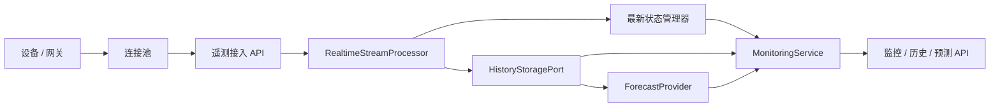

# Energy-Grid-Core

[English README](README.md)

Energy-Grid-Core 是一个面向“能源监控与设备状态管理”的通用后端基础项目。它从 `carbon` 服务中提取了可复用的工程模式，并剔除了学校场景、煤炭业务、用户认证耦合以及敏感接口，只保留了可公开复用的核心后端结构。

当前项目聚焦四类核心能力：

- 设备连接池管理
- 实时遥测数据接入与流处理
- 历史数据存储接口与默认实现
- 可插拔的时间序列预测接口

## 仓库状态

这个仓库已经整理到适合公开发布到 GitHub 的状态。

- 不包含硬编码密钥或环境专属地址
- 所有运行时配置都通过环境变量加载
- `.env`、`.venv`、`.DS_Store`、SQLite 数据文件等本地产物都已忽略
- 依赖版本已经固定到当前验证通过的版本

## 许可证说明

当前仓库是**源码可见，但不是开源授权**。

- 详细条款见 [LICENSE](LICENSE)
- 当前许可证状态是 `All rights reserved`
- 如果你后续希望他人复用、修改或二次分发，需要手动替换成你明确选择的许可证，例如 MIT 或 Apache-2.0

## 设计目标

- 通过有界队列和批量刷写机制支撑高并发实时数据接入
- 通过清晰的模块边界，隔离连接管理、流处理、历史存储和预测能力
- 为协议适配器和预测模型预留稳定扩展口
- 保持零硬编码密钥、零部署耦合配置

## 核心能力

### 1. 设备连接池

- `DeviceConnectionPool` 负责维护活跃设备连接，并控制最大并发连接数
- 心跳更新与历史落库分离，避免监控读取依赖同步写库
- 连接池可以输出当前连接快照，适合总览类监控接口直接使用

### 2. 实时流处理

- `RealtimeStreamProcessor` 通过 `asyncio.Queue` 接收标准化遥测事件
- 流数据会按批次刷写，降低突发流量下的存储争用
- 最新设备状态会先更新，再写入历史存储，保证监控总览读取更快

### 3. 历史数据存储接口

- `HistoryStoragePort` 定义了统一的追加写入和历史查询接口
- `SQLAlchemyHistoryStorage` 是默认实现，开箱即用写入 SQLite
- `InMemoryHistoryStorage` 仍然保留，适合轻量演示和隔离测试

### 4. 预测接口

- `ForecastProvider` 定义了统一的时间序列预测接口
- 当前内置 `NoopForecastProvider` 作为占位实现，保证服务在无模型依赖时也可运行
- 后续可以平滑接入 `Prophet`、ARIMA 或自定义模型，而无需改动 API 层

## 运行时架构



## 技术栈

- `Python 3.11`
- `FastAPI`
- `SQLAlchemy 2.0`
- `pytest`
- `httpx`

## 项目结构

```text
project-root/
├── app/
│   ├── api/             # 路由接口
│   ├── core/            # 核心配置与工具
│   ├── models/          # 数据库模型
│   └── services/        # 业务逻辑层
├── tests/               # 自动化测试
├── .env.example         # 环境变量模版（拒绝硬编码）
├── .gitignore
├── .editorconfig
├── LICENSE
├── pyproject.toml
├── requirements.txt
└── main.py              # 入口文件
```

## API 列表

- `POST /api/v1/devices/connect`：注册设备连接
- `DELETE /api/v1/devices/{device_id}`：移除设备连接
- `POST /api/v1/monitoring/ingest`：提交一条实时遥测数据
- `GET /api/v1/monitoring/overview`：获取当前监控总览
- `GET /api/v1/history/{device_id}`：查询单设备历史数据
- `POST /api/v1/forecast/{device_id}`：调用预测接口

## 环境要求

- Python `>=3.11,<4.0`
- macOS、Linux 或其他可以运行 FastAPI 与 SQLite 的环境

## 安装方式

```bash
python3 -m venv .venv
source .venv/bin/activate
pip install -r requirements.txt
cp .env.example .env
```

## 启动服务

```bash
source .venv/bin/activate
uvicorn main:app --host 0.0.0.0 --port 8000
```

默认 `.env.example` 使用 `HISTORY_STORAGE_BACKEND=sqlalchemy`，因此服务启动后会默认把遥测数据写入配置的 SQLite 数据库。

## 运行测试

```bash
source .venv/bin/activate
pytest
```

## 环境变量说明

| 变量名 | 用途 | 默认值 |
| --- | --- | --- |
| `APP_NAME` | 服务显示名称 | `Energy-Grid-Core` |
| `APP_VERSION` | 应用版本号 | `0.0.0.1` |
| `API_PREFIX` | API 统一前缀 | `/api/v1` |
| `APP_HOST` | 服务监听地址 | `0.0.0.0` |
| `APP_PORT` | 服务监听端口 | `8000` |
| `APP_DEBUG` | 是否开启调试模式 | `false` |
| `LOG_LEVEL` | 根日志级别 | `INFO` |
| `DATABASE_URL` | SQLAlchemy 数据库地址 | `sqlite:///./energy_grid_core.db` |
| `HISTORY_STORAGE_BACKEND` | 历史存储后端选择 | `sqlalchemy` |
| `MAX_DEVICE_CONNECTIONS` | 连接池最大连接数 | `1000` |
| `STREAM_QUEUE_MAXSIZE` | 遥测队列容量 | `50000` |
| `STREAM_BATCH_SIZE` | 批量刷写大小 | `500` |
| `STREAM_FLUSH_INTERVAL_SECONDS` | 最大刷写间隔 | `1.0` |
| `TELEMETRY_RETENTION_PER_DEVICE` | 单设备内存保留上限 | `1000` |
| `DEFAULT_HISTORY_LIMIT` | 默认历史查询条数 | `200` |
| `DEFAULT_FORECAST_HORIZON` | 默认预测步长 | `24` |
| `FORECAST_PROVIDER` | 预测实现标识 | `noop` |

## 为什么这个骨架适合高并发场景

- 连接生命周期和历史落库解耦
- 最新状态读取不需要扫描全量历史数据
- 批量写入可以把大量小写操作合并成更少的存储调用
- 运行时阈值全部走环境变量，便于根据真实流量调参

## 后续扩展方向

- 将 SQLite 替换为 PostgreSQL、TimescaleDB 或 ClickHouse
- 接入 MQTT、Modbus TCP、OPC UA、HTTP 轮询等真实协议适配器
- 实现基于 Prophet 或其他模型的真实预测能力
- 在单进程吞吐不足时，引入分布式缓存和消息队列
